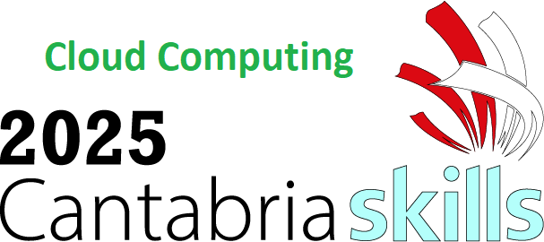
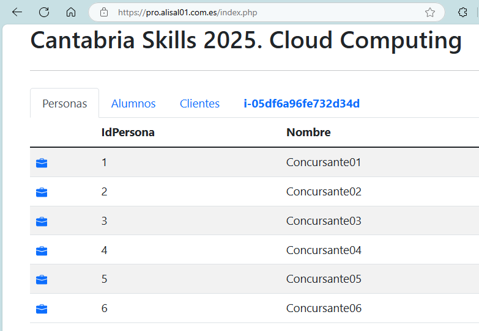

# Cantabria Skills 2025. Cloud Computing

## 1. Introducción

Este repositorio ha sido creado para **Cantabria Skills 2025**  en la especialidad de **Cloud Computing**.



## 2. Descripción

Es necesario crear un servidor con apache2, php, php-curl, php-mysql y mysql-client.

Y si está todo correctamente configurado se debería ver una página como la siguiente:


## 3. Instalación en una instancia EC2 en AWS

A la hora de crear una instancia EC2 se puede meter un script de inicio para que se instale todo lo necesario en el campo de **Userdata**.

Habría que cambiar los valores de usuario, password, servidor, BBDD por los que quieras para tu configuración. 
Hay que tener en cuenta que en este ejemplo se ha puesto una BBDD RDS de ejemplo en AWS, pero se puede cambiar por cualquier otra BBDD que tengas en tu red local o en otro servidor.

```shell
#!/bin/bash
apt -y update
apt -y upgrade
apt install -y apache2 php php-mysql mysql-client php-curl
cd /var/www/html/
rm index.html
git clone https://github.com/IESAlisal/25CantabriaSkillsCloud .
# Crea el fichero de configuración de la BBDD a partir del fichero de ejemplo
cp vars-sample.php vars.php
service apache2 restart

#Modificar el fichero de configuración de la BBDD
#para que funcione la aplicación                                                                       
BBDDUsuario="admin"
BBDDPassword="admin12345"
BBDDServidor="???gestion.c2wpdbm91fjm.us-east-1.rds.amazonaws.com"
BBDD="skillsbbdd"
NumServidor=$RANDOM

# Cambiar el fichero de constantes por los datos correctos
sed -i "s/localhost/$BBDDServidor/g"    /var/www/html/vars.php
sed -i "s/user/$BBDDUsuario/g"     	    /var/www/html/vars.php
sed -i "s/usuariopass/$BBDDPassword/g"  /var/www/html/vars.php
sed -i "s/libros/$BBDD/g"               /var/www/html/vars.php
sed -i "s/1Uno/$NumServidor/g"          /var/www/html/vars.php

```

## 4. Instalación manual

Para instalarlo manualmente en el sitio web por defecto del apache2 se puede hacer lo siguiente:

```shell
sudo apt update -y
sudo apt upgrade -y  
sudo apt install apache2 php php-mysql mysql-client php-curl

cd /var/www/html/
rm index.html
git clone https://github.com/IESAlisal/25CantabriaSkillsCloud .

# Crea el fichero de configuración de la BBDD a partir del fichero de ejemplo
cp vars-sample.php vars.php
# modifica ese fichero vars.php con tus datos de la BBDD

service apache2 restart

```

## 5. Importación de los datos de ejemplo en la base de datos

Para importar los datos de ejemplo en la base de datos, se puede hacer de la siguiente manera:

```shell
mysql  -u admin -padmin12345 -h ???gestion.c2wpdbm91fjm.us-east-1.rds.amazonaws.com skillsbbdd < /var/www/html/data/datos.sql 
```
